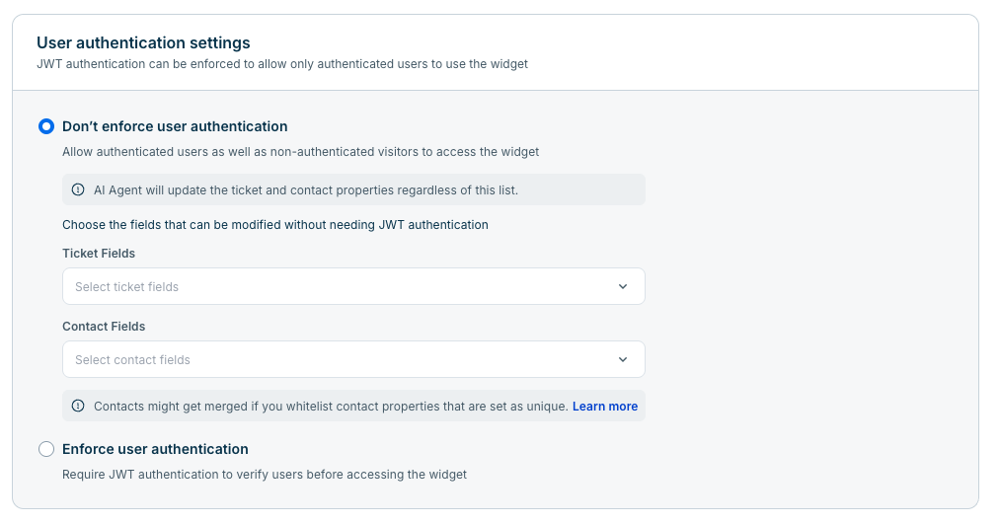

# Freshdesk Android SDK
"Modern ticketing software that your sales and customer engagement teams will love [FreshdeskSDK](https://www.freshworks.com)"

## Installation
To include the SDK into your android application follow the steps mentioned below.

1. Add/Ensure MavenCentral repository is included for your project. In your project level `build.gradle` make sure the `repositories` block has `mavenCentral()`.
   ```groovy
     repositories {
       mavenCentral()
     }
   ```
2. Add the following dependency to your app-level `build.gradle` or `build.gradle.kts`:
   ```groovy
    dependencies {
      implementation 'com.freshworks.sdk:freshdesk:2.2.0'
    }
   ```

> **Platform requirement:** Freshdesk Android SDK requires devices running Android 8 Oreo (API level 26) or higher.

## Documentation
### SDK Initialization
To initialize the SDK, you can call the `initialize` method as shown below.
You can get your credentials for the placeholders mentioned in the below snippet from the "Mobile Chat SDK" page in your portal.
Go to Admin Settings -> Mobile Chat SDK

```kotlin
  FreshdeskSDK.initialize(
                context,
                SDKConfig(
                    token = "<Your token>",
                    host = "<Your host>",
                    sdkID = "<Your SDK ID>",
                    locale = "ar", // Set your desired locale here
                    jwt = "<Your JWT if any>",
                    debugMode = true // Enable debug mode for logging
                )
            ) {
                // SDK initialized callback. You can perform other SDK actions safely after initialization, here.
            }
```

You can also pass an initial `contentConfiguration` through `SDKConfig` if you want to customise widget copy at startup. See [Content configuration](#content-configuration) below.

### List of APIs/Usage
#### Support Home
Usage
```kotlin
  FreshdeskSDK.openSupport(context) //Pass context
```
Call this method to open the SDK into the landing page.

#### Knowledge Base
Usage
```kotlin
  FreshdeskSDK.openKnowledgeBase(context) //Pass context
```
Call this method to open the SDK into the FAQ/Knowledge base page directly.

### Topic
Usage
```kotlin
  FreshdeskSDK.openTopic(
                        context, //Activity context
                        topicName, //The name of the topic.
                        topicId //The ID of the topic if you have. (Optional)
                    )
```
Call this method to open the SDK into a particular topic directly.

### Getting unread message count
Getting unread count requires listening to the an event through a broadcast listener. The event will have the details regarding the total unread messages, which can be read. Refer to the below example.
* Register a broadcast listener, wherever appropriate in your application. An activity, or even the application class
   ```kotlin
     val unreadCountReceiver = object : BroadcastReceiver() {
            override fun onReceive(
                context: Context?,
                intent: Intent?
            ) {
                if (intent?.action == SDKEventID.UNREAD_COUNT) {
                    val unreadCount = intent.getIntExtra(SDKEventID.UNREAD_COUNT, 0)
                    // Use unreadCount as needed
                }
            }
        }
     LocalBroadcastManager.getInstance(context).registerReceiver(
            unreadCountReceiver,
            IntentFilter(SDKEventID.UNREAD_COUNT)
        )
   ```
 * Make sure you unregister the receiver once you are done, to prevent memory leaks
   ```kotlin
      LocalBroadcastManager.getInstance(context).unregisterReceiver(
            unreadCountReceiver
        )
   ```

### Tracking user events
Freshdesk allows you to track any events performed by your users. It can be anything, ranging from updating their profile picture to adding 5 items to the cart. You can use these events as context while engaging with the user. Events can also be used to set up triggered messages or to segment users for campaigns.

Usage
```kotlin
  FreshdeskSDK.trackEvent(eventName, eventValueMap)
```

### Whitelisting contact and ticket fields (Agent portal)
When JWT authentication is **not enforced** for the SDK-linked widget, only contact and ticket fields explicitly added in the Agent portal can be populated via `setUserProperties` and `setTicketProperties`. Fields not selected here are ignored by the SDK.

To configure this:
1. Open the SDK-linked web chat widget in your Freshdesk admin portal (**Widget Configuration**).
2. Go to the **User authentication** tab.
3. Under **User authentication settings**, select **Don't enforce user authentication**.
4. In **Choose the fields that can be modified without needing JWT authentication**, add the fields you want the SDK to be allowed to update:
   - **Contact Fields** — fields that `setUserProperties` can populate (for example `name`, `email`, custom contact fields).
   - **Ticket Fields** — fields that `setTicketProperties` can populate (for example `subject`, `priority`, custom ticket fields).



The screenshot above shows the **User authentication** tab of the **Widget Configuration** page, where you whitelist ticket and contact fields for SDK updates when JWT authentication is not enforced.

Note:
- Only fields added to these dropdowns can be set from the SDK. Passing a property that is not whitelisted has no effect.
- Whitelisting contact properties that are configured as **unique** in Freshdesk may cause contacts to be merged. Review your contact field configuration before enabling them here.

When JWT authentication **is enforced**, use `authenticateAndUpdate` with the properties included in the JWT payload instead of `setUserProperties` / `setTicketProperties`. See [JWT User Authentication](#jwt-user-authentication) below.

### Setting user properties
Use `setUserProperties` to create or update the current user's contact details from your app.

Usage
```kotlin
  val userProperties: Map<String, Any> = mapOf(
      "name" to "Mobile Android SDK",
      "address" to "Chennai, India",
      "mobile" to "1234567890",
      "phone" to "9876543210",
      "customnumber" to 123 // custom contact field
  )
  FreshdeskSDK.setUserProperties(userProperties)
```

Note:
1. Each key in the map must correspond to a field listed under **Contact Fields** in the [whitelisting](#whitelisting-contact-and-ticket-fields-agent-portal) section above. Only whitelisted fields are updated.
2. This API applies when the widget uses **Don't enforce user authentication**. When JWT is enforced, include user properties in the JWT and call `authenticateAndUpdate` instead.
3. To switch to a different authenticated user, call `resetUser` first before passing a new JWT or user properties.

### Setting ticket properties
Use `setTicketProperties` to attach ticket fields to the conversation created in a topic.

Usage
```kotlin
  val ticketProperties: Map<String, Any> = mapOf(
      "subject" to "Product Enquiry",
      "priority" to 3,
      "cf_custom_ticket_field" to "samplevalue" // custom ticket field
  )
  FreshdeskSDK.setTicketProperties(ticketProperties)
```

Note:
1. Each key in the map must correspond to a field listed under **Ticket Fields** in the [whitelisting](#whitelisting-contact-and-ticket-fields-agent-portal) section above. Only whitelisted fields are updated.
2. Values are sent to Freshdesk only when the user sends a message **after** calling this method.
3. When JWT authentication is **enforced**, include ticket properties in the JWT payload and call `authenticateAndUpdate` instead.

### Content configuration
Use `ContentConfiguration` to customise static text shown in the widget — for example chat headers, FAQ labels, placeholders, ticket form text, privacy policy banner, and response-time messages. Any field you omit uses the widget default from your admin portal configuration.

You can apply content configuration during initialization:
```kotlin
  FreshdeskSDK.initialize(
      context,
      SDKConfig(
          token = "<Your token>",
          host = "<Your host>",
          sdkID = "<Your SDK ID>",
          locale = "ar",
          contentConfiguration = ContentConfiguration(
              headers = HeaderContent(
                  chat = "Talk to our team",
                  faq = "Help articles",
                  typicallyRepliesFewMinsFallback = "Typically replies in a few minutes",
                  channelResponse = ChannelResponseContent(
                      offline = "We are away right now",
                      online = ChannelResponseOnlineContent(
                          default = "We typically reply in a few minutes",
                          minutes = TimeUnitTemplates(
                              one = "Typically replies in {{time}} minute",
                              more = "Typically replies in {{time}} minutes"
                          )
                      )
                  ),
                  ticketForm = TicketFormContent(
                      title = "Raise a ticket",
                      submitBtnTitle = "Submit"
                  )
              ),
              placeholders = PlaceholderContent(
                  replyField = "Type your reply...",
                  searchField = "Search articles..."
              ),
              privacyPolicySetting = PrivacyPolicyContent(
                  privacyPolicyMessage = "We respect your privacy",
                  privacyPolicyLinkText = "Privacy policy",
                  privacyPolicyLink = "https://example.com/privacy"
              )
          )
      )
  ) {
      // SDK initialized
  }
```

To update content configuration after initialization:
```kotlin
  FreshdeskSDK.setContentConfiguration(
      ContentConfiguration(
          headers = HeaderContent(chat = "Chat now"),
          placeholders = PlaceholderContent(replyField = "Your message...")
      )
  )
```

To clear overrides and fall back to widget defaults:
```kotlin
  FreshdeskSDK.setContentConfiguration(null)
```

Note: `setContentConfiguration` persists the updated values. If the widget is already loaded, the SDK refreshes it so changes take effect immediately.

### Get user
Use `getUser` to retrieve the current user in session asynchronously. Callbacks are invoked on the main thread.

Usage
```kotlin
  FreshdeskSDK.getUser(
      userCallback = { user ->
          // user.alias, user.email, user.firstName, user.customProps, etc.
      },
      onFailure = { error ->
          // Handle error
      }
  )
```

### JWT User Authentication
Freshdesk uses JSON Web Token (JWT) to allow only authenticated users to initiate a conversation with you through the Freshdesk messenger. To use this capability, follow the steps below.
1. Create a JWT with the encryption key that can be found in your SDK page in the admin portal (Admin Settings -> Mobile Chat SDK -> Your SDK)
   (To learn more about this refer to this [link](https://support.freshdesk.com/en/support/solutions/articles/50000011580-authenticate-users)
2. Initialize the SDK by passing the generated JWT along with the `SDKConfig` object.
   ```kotlin
     FreshdeskSDK.initialize(
                context,
                SDKConfig(
                    token = "<Your token>",
                    host = "<Your host>",
                    sdkID = "<Your SDK ID>",
                    locale = "ar", // Set your desired locale here
                    jwt = "<The token you generated from Step 1 goes here>",
                )
            ) {
                // SDK initialized callback. You can perform other SDK actions safely after initialization, here.
            }
   ```
3. Listen to JWT events through a broadcast receiver like below.
   ```kotlin
     //Define your receiver
      val userStateReceiver = object : BroadcastReceiver() {
          override fun onReceive(
              context: Context?,
              intent: Intent?
          ) {
              if (intent?.action == SDKEventID.USER_STATE_CHANGE) {
                  val userState = intent.getStringExtra(SDKEventID.USER_STATE_CHANGE)
                  when (userState) {
                      UserState.UNDEFINED -> { } // Default
                      UserState.IDENTIFIER_UPDATED -> { } // Unique user identifier updated for a user
                      UserState.NOT_AUTHENTICATED -> { } // Invalid/Expired token is passed
                      UserState.AUTH_EXPIRED -> { } // JWT passed has expired
                      UserState.JWT_ABSENT -> { } // JWT was not passed during init for an enforced JWT SDK linked Widget
                      UserState.AUTHENTICATED -> { } // JWT passed is successfully authenticated or restored
                  }
              }
          }
      }
        
      //Register your receiver
      LocalBroadcastManager.getInstance(context).registerReceiver(
          userStateReceiver,
          IntentFilter(SDKEventID.USER_STATE_CHANGE)
      )
   ```
4. To update a new JWT during an expiry of a previously passed JWT, or to update user/ticket properties for an authenticated user, call the below method.
   ```kotlin
     FreshdeskSDK.authenticateAndUpdate(<JWT>)
   ```

Note:
1. When JWT use is **enforced** in the widget settings in your admin portal, it is mandatory to pass the JWT during initialization. The SDK initialization will fail otherwise.
2. `authenticateAndUpdate` handles authentication and can also carry user or ticket property updates in the JWT payload. When JWT is enforced, prefer this over `setUserProperties` / `setTicketProperties`.
3. To authenticate a different user, call `resetUser` first before calling `authenticateAndUpdate` with the new user's JWT.

### Push notifications
To receive real-time push notifications for incoming messages:

1. Upload your FCM Service Account Key in the admin portal: **Admin Settings -> Mobile Chat SDK -> Push Notification**.
2. Add `google-services.json` to your app module.
3. Forward the FCM token and notification payloads to the SDK from your `FirebaseMessagingService`:

```kotlin
  class MyFirebaseMessagingService : FirebaseMessagingService() {

      override fun onNewToken(token: String) {
          super.onNewToken(token)
          FreshdeskSDK.setPushRegistrationToken(token)
      }

      override fun onMessageReceived(message: RemoteMessage) {
          super.onMessageReceived(message)
          if (FreshdeskSDK.isFreshdeskSDKNotification(message.data)) {
              FreshdeskSDK.handleFCMNotification(message.data)
          }
      }
  }
```

4. Register the service in `AndroidManifest.xml`:
```xml
  <service
      android:name=".MyFirebaseMessagingService"
      android:exported="false">
      <intent-filter>
          <action android:name="com.google.firebase.MESSAGING_EVENT"/>
      </intent-filter>
  </service>
```

### Notification configuration
Use `setNotificationConfig` to customise notification appearance and behaviour (icons, sound, importance, etc.). Call this after SDK initialization, typically from your `Application` class.

Usage
```kotlin
  FreshdeskSDK.setNotificationConfig(
      NotificationConfig(
          soundEnabled = true,
          smallIconResId = R.drawable.ic_notification,
          largeIconResId = R.drawable.ic_notification,
          importance = NotificationManager.IMPORTANCE_HIGH
      )
  )
```

### SDK events
In addition to unread count and JWT state changes, the SDK broadcasts other events you can listen for with `LocalBroadcastManager`:

| Event constant | Description |
|---|---|
| `SDKEventID.USER_CREATED` | A new user session was created. The `User` object is available in the intent extras. |
| `SDKEventID.USER_CLEARED` | The current user session was cleared (for example after `resetUser`). |
| `SDKEventID.USER_AUTHENTICATED` | The user was successfully authenticated. |
| `SDKEventID.MESSAGE_SENT` | A message was sent from the widget. |
| `SDKEventID.MESSAGE_RECEIVED` | A message was received in the widget. |
| `SDKEventID.DOWNLOAD_FILE` | A file download was initiated from the widget. |

Example — register for multiple events in your `Application` class:
```kotlin
  val sdkEventReceiver = object : BroadcastReceiver() {
      override fun onReceive(context: Context?, intent: Intent?) {
          when (intent?.action) {
              SDKEventID.USER_CREATED -> {
                  val user = if (Build.VERSION.SDK_INT >= Build.VERSION_CODES.TIRAMISU) {
                      intent.extras?.getParcelable(SDKEventID.USER_CREATED, User::class.java)
                  } else {
                      @Suppress("DEPRECATION")
                      intent.extras?.getParcelable(SDKEventID.USER_CREATED)
                  }
                  // Handle new user
              }
              SDKEventID.MESSAGE_RECEIVED -> { /* Handle message received */ }
          }
      }
  }

  LocalBroadcastManager.getInstance(context).registerReceiver(
      sdkEventReceiver,
      IntentFilter().apply {
          addAction(SDKEventID.USER_CREATED)
          addAction(SDKEventID.USER_CLEARED)
          addAction(SDKEventID.USER_AUTHENTICATED)
          addAction(SDKEventID.MESSAGE_SENT)
          addAction(SDKEventID.MESSAGE_RECEIVED)
          addAction(SDKEventID.DOWNLOAD_FILE)
      }
  )
```

### Custom Link Handler
The SDK by default, opens any link in the conversation, or FAQs in a new browser session if a browser is present. However, the host application can take control of this redirection and decide how to open links. For this to work, the SDK can accept a custom implementation of a `FreshDeskSDKLinkHandler`.
For example, an Activity or Fragment can implement this `FreshDeskSDKLinkHandler` interface and override the `handleLink(url: String)` method.
Usage
```kotlin
  FreshdeskSDK.setLinkHandler(<FreshDeskSDKLinkHandler>)
```
Note: Make sure the application holds a solid reference to the implementation of the `FreshDeskSDKLinkHandler` (no weak references) or it may be garbage collected.

Pass `null` to restore the default link handling behaviour.

### User interaction listener
Use `setFreshdeskUserInteractionListener` to be notified when the user interacts with the Freshdesk widget UI (for example taps or scrolls inside the widget).

Usage
```kotlin
  FreshdeskSDK.setFreshdeskUserInteractionListener(object : FreshdeskUserInteractionListener {
      override fun onUserInteraction() {
          // User interacted with the widget
      }
  })
```

Call `setFreshdeskUserInteractionListener(null)` to remove the listener.

### WebView locale listener
If the user changes locale inside the widget WebView, you can react to that change by registering a `FreshdeskWebviewListener`. This is useful when your app manages locale separately and needs to stay in sync.

Usage
```kotlin
  FreshdeskSDK.setWebViewListener(object : FreshdeskWebviewListener {
      override fun onLocaleChangedByWebView() {
          // Re-apply your app's locale if needed
      }
  })
```

### Dismiss Freshdesk SDK views
To dismiss any open FreshdeskSDK screens from anywhere in your application, use the following method.
Usage
```kotlin
  FreshdeskSDK.dismissFreshdeskViews()
```

### Reset User
The `resetUser` method allows you to clear the current user's session and data from the SDK. This is particularly useful when a user logs out of your application or when you want to switch between different user accounts. When called, this method will reset all user-specific data including conversations, user properties, and authentication state.

Usage
```kotlin
  FreshdeskSDK.resetUser(
      onSuccess = { message ->
          // Handle successful user reset
          // Perform any cleanup operations needed in your app
          Log.d("FreshdeskSDK", "User reset successful: $message")
      },
      onFailure = { errorMessage ->
          // Handle failure case
          Log.e("FreshdeskSDK", "Failed to reset user: $errorMessage")
      }
  )
```

Example - Reset user on logout:
```kotlin
  fun logoutUser() {
      FreshdeskSDK.resetUser(
          onSuccess = {
              // Clear your app's user session
              clearUserSession()
              // Navigate to login screen
              navigateToLogin()
          },
          onFailure = { error ->
              // Even on failure, you might want to clear local state
              clearUserSession()
              showErrorMessage("Failed to reset Freshdesk user: $error")
          }
      )
  }
```

Note: You should call `resetUser` before initializing the SDK with a different user's credentials or configuration, to make sure any existing user session is cleared properly.
